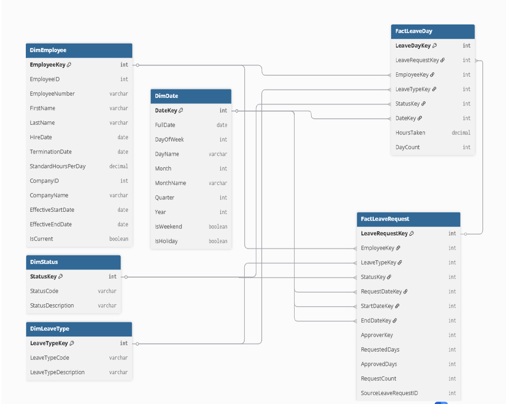

<h1 style="color:#2E86C1;">Leave Analysis Data Engineering Exercise</h1>

---

## Project Overview  
This project is part of a data engineering exercise focused on analyzing employee leave data from a payroll system.

The solution includes:
- Business insight generation  
- Dimensional modeling (star schema)  
- SQL transformations to build fact tables  

The goal is to help business owners better understand employee leave behavior, approval processes, and workforce planning.

---

## Dataset Overview  

### Source Tables  
- LeaveRequest (request-level data)  
- LeaveDay (day-level leave records)  

### Leave Types  
- AL – Annual Leave  
- SL – Sick Leave  
- UPL – Unpaid Leave  
- OTHER  

---

## Database Design (Before vs After)

### Before: Source Schema (Normalized)


### After: Dimensional Model (Star Schema)



The original normalized schema is transformed into a star schema to support efficient analytical queries and reporting.

---

## Part A — Business Insights  

### 1. Top Employees by Leave Type  

**Measures**  
- Total Leave Days Taken = SUM(DayCount)  

**Purpose**  
Identifies employees with high leave usage across categories and helps detect excessive leave patterns.

---

### 2. Leave Utilization (Employee & Company Level)  

**Measures**  
- Total Leave Hours = SUM(HoursTaken)  
- Expected Work Hours = StandardHours × Working Days  
- Leave Utilization Ratio = Leave Hours / Expected Work Hours  

**Purpose**  
Shows how much working time is spent on leave and helps identify productivity risks.

---

### 3. Leave Approval Efficiency  

**Measures**  
- Approval Ratio (%)  
- Average Lead Time (Request Date → Start Date)  

**Purpose**  
Evaluates how efficiently leave requests are processed and identifies delays.

---

### 4. Average Leave Duration  

**Measures**  
- Average Days per Leave Request  

**Purpose**  
Helps understand whether employees take short or long leave periods.

---

### 5. Monthly Sick and Unpaid Leave Trends  

**Measures**  
- Total Sick Leave Days  
- Total Unpaid Leave Days  

**Purpose**  
Identifies seasonal patterns and unusual spikes in leave usage.

---

### 6. Leave Application Lead Time  

**Measures**  
- Average Lead Time  
- Last-Minute Requests (≤1 day)  
- Planned Requests (>7 days)  

**Purpose**  
Shows whether leave is planned or last-minute, helping improve scheduling.

---

### 7. Upcoming Leave Coverage (Next 30 Days)  

**Measures**  
- Employees on Leave per Day  

**Purpose**  
Supports short-term workforce planning and ensures adequate staffing.

---

### 8. Monthly Leave Seasonality  

**Measures**  
- Total Leave Requests  
- Total Leave Days  

**Purpose**  
Identifies peak and low leave periods.

---

### 9. Leave Before Termination  

**Measures**  
- Leave Days in Last 90 Days  

**Purpose**  
Detects patterns of increased leave before employee exit.

---

## Part B — Dimensional Model  

### Design Approach  

Two levels of analysis are required:
1. Request-level analysis  
2. Day-level analysis  

To support both, two fact tables are used.

---

### Fact Tables  

**FactLeaveRequest**  
- Stores request-level data  
- Includes request dates, leave type, status, and duration  

**FactLeaveDay**  
- Stores day-level data  
- Tracks actual leave days and hours  

---

### Dimension Tables  

- **DimEmployee** (SCD Type 2)  
- **DimDate** (calendar dimension)  
- **DimLeaveType** (SCD Type 1)  
- **DimStatus** (SCD Type 1)  

---

### Design Decisions  

- Two fact tables maintain correct granularity  
- Employee dimension is denormalized for performance  
- Star schema simplifies reporting and reduces joins  

---

## Part C — SQL Implementation  

### FactLeaveRequest  

```sql
INSERT INTO FactLeaveRequest (
    EmployeeKey,
    LeaveTypeKey,
    StatusKey,
    RequestDateKey,
    StartDateKey,
    EndDateKey,
    ApproverKey,
    RequestedDays,
    ApprovedDays,
    RequestCount,
    SourceLeaveRequestID
)
SELECT 
    de.EmployeeKey,
    dlt.LeaveTypeKey,
    ds.StatusKey,
    ddReq.DateKey,
    ddStart.DateKey,
    ddEnd.DateKey,
    NULL,
    DATEDIFF(lr.EndDate, lr.StartDate) + 1,
    CASE 
        WHEN lr.StatusCode = 'APPROVED' 
        THEN (DATEDIFF(lr.EndDate, lr.StartDate) + 1)
        ELSE 0 
    END,
    1,
    lr.LeaveRequestID
FROM LeaveRequest lr
JOIN DimEmployee de ON lr.EmployeeID = de.EmployeeID
JOIN DimLeaveType dlt ON lr.LeaveTypeCode = dlt.LeaveTypeCode
JOIN DimStatus ds ON lr.StatusCode = ds.StatusCode
JOIN DimDate ddReq ON ddReq.FullDate = lr.RequestDate
JOIN DimDate ddStart ON ddStart.FullDate = lr.StartDate
JOIN DimDate ddEnd ON ddEnd.FullDate = lr.EndDate;
